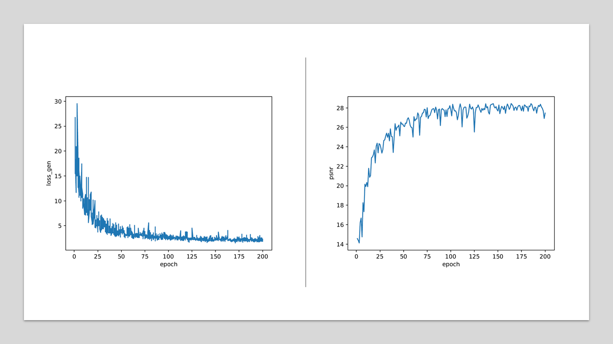

<div align="center">
<h1>Facial Shadow Removal</h1>
</div>


このプロジェクトは[Zhangらの研究](https://github.com/zhangbaijin/SpA-Former-shadow-removal)
に基づいています．学習モデルの詳しい構造についてはそちらのページをご覧ください．
# Qucikly run
## 1.1. Prepare
まず最初に[こちら](https://drive.google.com/drive/folders/1msa7-CZBNfkE8LwEcrT5lCcOd-lnkmB8?usp=sharing)
からデータセットをダウンロードしてください．訓練済みモデルが欲しい場合は[こちら](https://drive.google.com/file/d/1_hHy_tWc1B_yKRjctfcOs6UvciIOuQ7s/view?usp=sharing)
からダウンロードして適当な場所に入れてください．（データセットには[helen](https://paperswithcode.com/dataset/helen)を用いています．）
## 1.2. TRAIN
```config.yml```でパラメータを設定し，以下のコマンドを実行してモデルを訓練します．
```bash
python train.py
```

## 1.3. TEST
任意の画像でテストしたい場合は顔のみが映る256*256の画像を用意してください．
```cascade.py```を使うことで簡単に顔をカスケードすることができます．
その場合```./data/cascade/input/```にカスケードしたい画像を入れて実行してください．

カスケードした画像を```./data/test/test_A/```に入れて以下のコマンドを実行します．
```bash
python predict.py --config <path_to_config.yml_in_the_out_dir> --test_dir <path_to_a_directory_stored_test_data> --out_dir <path_to_an_output_directory> --pretrained <path_to_a_pretrained_model> --cuda
```
## 1.4.Evaluate 
学習済みモデルの全テスト結果は```./out/epoch_0001/```にあります．ここでは一部を紹介します．
*valデータに対する結果*

*未知データに対する結果*

*PSNRとgenerator損失関数の推移*

# 2. データセット作成手順

## 2.1. Cascade
```cascade.py```を使うことで簡単に顔をカスケードすることができます．
その場合```./data/cascade/input/```にカスケードしたい画像を入れて実行してください．

## 2.2. Segmentation
カスケードした画像を全て```./data/mk_datasets/data_C/```に入れて以下を実行します．
```bash
python mk_mask.py
```
```./data/mk_datasets/segment_mask/```にセグメンテーションマスクが出力されます．
ただし，ailia-modelの「human_part_segmentation」を用いているため，ライセンスを取得し，コード内のscript_pathに```human_part_segmentation.py```
の絶対パスを指定することを忘れないでください．

## 2.3. Composite Shadows
2.1~2で得たカスケード画像とセグメンテーションマスクを用いて以下のコードを実行すると，
影付き画像と影マスクを生成することができます．
```bash
python mk_datasets.py
```

ここまで行えば，data_A, data_B, data_Cにそれぞれ影付き画像，影マスク，影なし画像
が出力されているはずです．このABCは訓練データとテストデータのABCに対応しています．
お好みで移動させてください．

# 3. 手法
前項の手順を図説するとこうなります．パーリンノイズのシード値やガウシアンブラーのカーネルを
ランダム化することで多様な影を出力しています．
*手法図*


